# RabbitMQ Event-Driven Architecture

## Overview

HireMind now uses RabbitMQ for inter-agent communication and workflow orchestration.
The system no longer relies on in-process message passing for agent coordination.
RabbitMQ provides durable queues, retry handling, dead-letter queues, and event persistence.

## Topology

- Exchange: `hiremind.agent.exchange` (topic)
- Event Exchange: `hiremind.domain.exchange` (topic)
- Dead-letter Exchange: `hiremind.dlx` (topic)

### Agent queues

- `hiremind.agent.supervisor`
- `hiremind.agent.cv_analysis`
- `hiremind.agent.job_analysis`
- `hiremind.agent.matching`
- `hiremind.agent.hiring_rules`
- `hiremind.agent.recruiter_feedback`
- `hiremind.agent.interview`

### Retry and DLQ naming

- Retry queue: `hiremind.agent.<agent>.retry`
- Dead-letter queue: `hiremind.agent.<agent>.dlq`

## Event Schema

The platform defines these domain events:

- `CandidateUploaded`
- `ResumeParsed`
- `CandidateMatched`
- `InterviewScheduled`
- `InterviewCompleted`
- `FeedbackSubmitted`
- `CandidateRejected`
- `CandidateHired`

Each event is represented by `DomainEvent` in `ai_engine.agents.events` and stored in the `domain_events` table.

### Routing keys

Event routing keys are generated from event names:

- `event.candidate.uploaded`
- `event.resume.parsed`
- `event.candidate.matched`
- `event.interview.scheduled`
- `event.interview.completed`
- `event.feedback.submitted`
- `event.candidate.rejected`
- `event.candidate.hired`

Agent task routing uses keys like:

- `agent.supervisor`
- `agent.cv_analysis`
- `agent.job_analysis`
- `agent.matching`
- `agent.hiring_rules`
- `agent.recruiter_feedback`
- `agent.interview`

## Workflow coordination

1. The Supervisor publishes a task message to the RabbitMQ exchange.
2. An agent worker consumes the message from its durable queue.
3. The agent executes the task.
4. The result is published back to the Supervisor queue.
5. The Supervisor waits for the response and continues workflow orchestration.

## Reliability guarantees

- Durable queues preserve messages through broker restarts.
- Messages are acknowledged only after processing completes.
- Failed messages are retried with exponential backoff.
- Messages exceeding max retries are routed to DLQs.
- Domain events are persisted in the database for replay and audit.

## RabbitMQ diagram

```mermaid
flowchart TD
    subgraph Broker[RabbitMQ Broker]
        A[hiremind.agent.exchange] --> |agent.supervisor| SupervisorQ[hiremind.agent.supervisor]
        A --> |agent.cv_analysis| CVQ[hiremind.agent.cv_analysis]
        A --> |agent.job_analysis| JobQ[hiremind.agent.job_analysis]
        A --> |agent.matching| MatchingQ[hiremind.agent.matching]
        A --> |agent.hiring_rules| RulesQ[hiremind.agent.hiring_rules]
        A --> |agent.recruiter_feedback| FeedbackQ[hiremind.agent.recruiter_feedback]
        A --> |agent.interview| InterviewQ[hiremind.agent.interview]

        subgraph Retry[Retry Topology]
            CVQ --> CVRetry[hiremind.agent.cv_analysis.retry]
            JobQ --> JobRetry[hiremind.agent.job_analysis.retry]
            MatchingQ --> MatchingRetry[hiremind.agent.matching.retry]
        end

        subgraph DLQ[Dead Letter Queues]
            SupervisorQ --> SupervisorDLQ[hiremind.agent.supervisor.dlq]
            CVQ --> CVDLQ[hiremind.agent.cv_analysis.dlq]
            JobQ --> JobDLQ[hiremind.agent.job_analysis.dlq]
        end
    end

    SupervisorApp[Supervisor App] --> |publish task| A
    CVWorker[CV Analysis Worker] --> |consume task| CVQ
    JobWorker[Job Analysis Worker] --> |consume task| JobQ
    MatchingWorker[Matching Worker] --> |consume task| MatchingQ
    RulesWorker[Hiring Rules Worker] --> |consume task| RulesQ
    FeedbackWorker[Feedback Worker] --> |consume task| FeedbackQ
    InterviewWorker[Interview Worker] --> |consume task| InterviewQ

    CVWorker --> |publish result| A
    JobWorker --> |publish result| A
    MatchingWorker --> |publish result| A

    subgraph Events[Domain Events]
        EventExchange[hiremind.domain.exchange]
        SupervisorApp --> |CandidateMatched| EventExchange
        InterviewWorker --> |InterviewCompleted| EventExchange
    end
```

